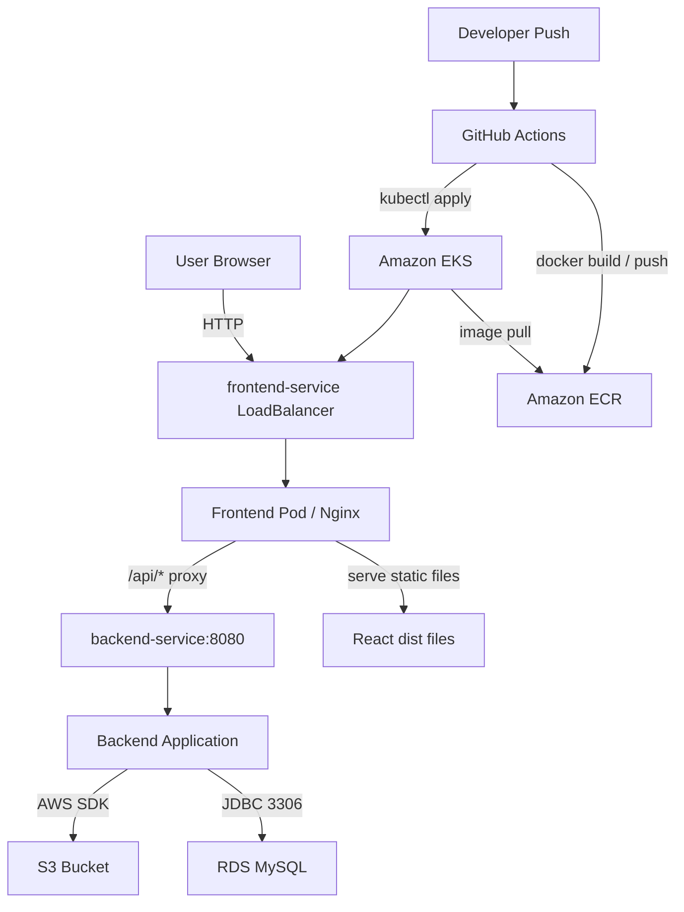
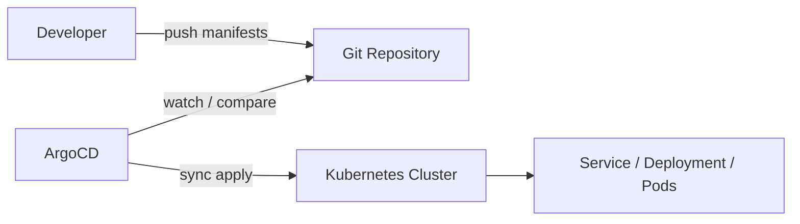
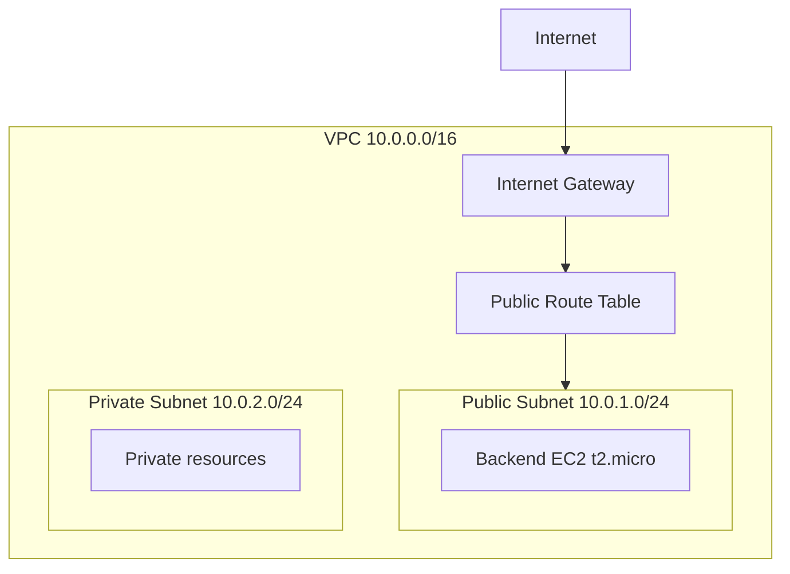
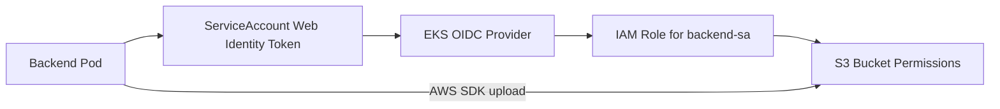

# AWS EKS Infrastructure Automation with Terraform & Kubernetes

Vite + React 기반의 샘플 프론트엔드 애플리케이션입니다. 정적 파일은 Nginx로 서빙하고, `/api/*` 요청은 Nginx 프록시를 통해 Kubernetes 내부 백엔드 서비스로 전달합니다.

이 저장소는 다음 범위를 포함합니다.

- React 프론트엔드 애플리케이션
- 프론트엔드 Docker 이미지 빌드 설정
- 프론트엔드 Kubernetes `Deployment`/`Service` 매니페스트
- GitHub Actions 기반 EKS 배포 워크플로
- Terraform 기반 VPC, subnet, backend EC2 인프라 코드

## 기술 스택

- React 18
- TypeScript
- Vite
- Nginx
- Docker
- Kubernetes
- Terraform
- AWS EKS, ECR, S3 backend
- GitHub Actions
- ArgoCD

## 프로젝트 구조

```text
.
├── src/                    # React 애플리케이션 소스
├── public/                 # 정적 리소스
├── k8s/frontend.yaml       # 프론트엔드 Deployment/Service
├── terraform/              # Terraform 인프라 코드
│   ├── modules/network/    # VPC/Subnet 네트워크 모듈
│   ├── main.tf             # AWS 네트워크 및 backend EC2 리소스
│   ├── provider.tf         # Provider 및 remote state 설정
│   ├── variables.tf        # Terraform 변수
│   ├── outputs.tf          # Terraform output
│   └── terraform.tfvars    # Terraform 변수 값
├── Dockerfile              # Vite 빌드 및 Nginx 런타임 이미지
├── nginx.conf              # 정적 파일 서빙 및 API 프록시 설정
└── vite.config.ts          # Vite 설정
```

## 전체 아키텍처

운영 배포는 GitHub Actions가 프론트엔드 이미지를 ECR에 push한 뒤, `${FRONTEND_IMAGE}`를 실제 이미지 주소로 치환해 EKS에 적용하는 흐름입니다. 브라우저는 프론트엔드 LoadBalancer만 호출하고, 백엔드 API는 Nginx가 클러스터 내부 서비스로 프록시합니다.




```text
Browser
  -> frontend-service LoadBalancer
  -> frontend Pod / Nginx
  -> React static files
  -> /api/* proxy
  -> backend-service:8080
  -> Backend Application
  -> S3 / Database
```

## GitOps와 ArgoCD

ArgoCD는 Kubernetes 클러스터 내부에서 동작하며, Git 저장소에 선언된 원하는 상태와 클러스터의 실제 상태를 비교해 동기화합니다.

```text
[개발자] -- Push --> [Git Repository] (Desired State)
                            ^
                            | watch / pull
                         [ArgoCD]
                            |
                            | sync apply
                            v
                  [Kubernetes Cluster] (Live State)
```



## AWS 인프라

### 현재 Terraform 범위

현재 Terraform 코드는 기본 네트워크와 backend EC2를 생성합니다.

```text
VPC
  CIDR: 10.0.0.0/16

Public Subnet
  CIDR: 10.0.1.0/24
  Route: 0.0.0.0/0 -> Internet Gateway

Private Subnet
  CIDR: 10.0.2.0/24

Backend EC2
  AMI: Latest Amazon Linux 2
  Instance type: t2.micro
  Subnet: public subnet
  Inbound: TCP 22, TCP 8080
```



현재 Terraform 코드에는 EKS 클러스터, ECR 저장소, NAT Gateway, private subnet route table은 포함되어 있지 않습니다. EKS와 ECR은 GitHub Secrets의 `EKS_CLUSTER_NAME`, `ECR_FRONTEND_URI`로 참조합니다.

### Terraform remote state

Terraform state는 S3 backend에 저장하고 DynamoDB table로 lock을 잡습니다.

```text
S3 bucket: myapp-terraform-state-20260429
State key: training/lab06/terraform.tfstate
Region: us-west-1
Lock table: terraform-lock
```

```bash
cd terraform
terraform init
terraform plan
terraform apply
```

## 프론트엔드 배포 구조

### Docker 이미지

Dockerfile은 2단계 빌드를 사용합니다.

1. `node:18-alpine`에서 의존성을 설치하고 Vite 애플리케이션을 빌드합니다.
2. `nginx:alpine`에서 `dist/` 결과물을 `/usr/share/nginx/html`로 서빙합니다.

```bash
docker build -t aws-lab-frontend .
```

외부 API 주소를 빌드 시점에 주입해야 하는 경우에만 build arg를 사용합니다.

```bash
docker build --build-arg VITE_API_BASE_URL=http://example.com -t aws-lab-frontend .
```

운영 배포에서는 Nginx가 `/api/*` 요청을 Kubernetes 내부 `backend-service:8080`으로 프록시하므로 `VITE_API_BASE_URL`을 주입하지 않아도 됩니다.

### Kubernetes 리소스

`k8s/frontend.yaml`은 다음 리소스를 정의합니다.

- `Namespace/sample-app`
- `Deployment/frontend`
- `Service/frontend-service`

```text
Deployment/frontend
  namespace: sample-app
  replicas: 2
  container port: 80
  readiness/liveness probe: /

Service/frontend-service
  namespace: sample-app
  type: LoadBalancer
  port: 80 -> targetPort: 80
```

배포 시 `${FRONTEND_IMAGE}` 값이 실제 ECR 이미지 주소로 치환되어야 합니다.

```bash
envsubst < k8s/frontend.yaml | kubectl apply -f -
```

## 프론트엔드와 백엔드 연결

Kubernetes 운영 환경에서 브라우저는 백엔드 주소를 직접 호출하지 않습니다. 프론트엔드와 같은 호스트의 `/api/*` 경로만 호출하고, Nginx가 내부 DNS 이름인 `backend-service`로 요청을 전달합니다.

```text
Browser
  -> http://frontend-loadbalancer/api/hello
  -> frontend Nginx
  -> http://backend-service:8080/api/hello
  -> backend
```

`src/App.tsx`는 API base URL을 다음 방식으로 결정합니다.

```ts
const apiBaseUrl = import.meta.env.VITE_API_BASE_URL ?? "";
```

- `VITE_API_BASE_URL`이 있으면 `${VITE_API_BASE_URL}/api/...`로 요청합니다.
- 값이 없으면 `/api/...`로 요청하고, 운영 환경에서는 Nginx가 백엔드로 프록시합니다.

`nginx.conf`의 API 프록시 설정은 다음과 같습니다.

```nginx
location /api/ {
    proxy_pass http://backend-service:8080/api/;
}
```

## 백엔드 ServiceAccount와 IRSA

백엔드가 S3에 파일을 업로드할 때는 정적 AWS access key를 컨테이너에 넣지 않고, EKS OIDC와 IRSA를 통해 IAM Role을 위임받는 구성을 권장합니다.



흐름은 다음과 같습니다.

1. Backend Pod가 `backend-sa` ServiceAccount로 실행됩니다.
2. ServiceAccount annotation이 S3 권한을 가진 IAM Role ARN을 가리킵니다.
3. AWS SDK가 web identity token으로 `AssumeRoleWithWebIdentity`를 호출합니다.
4. 백엔드는 임시 자격 증명으로 S3에 업로드합니다.

필요한 Kubernetes ServiceAccount 예시는 다음과 같습니다.

```yaml
apiVersion: v1
kind: ServiceAccount
metadata:
  name: backend-sa
  namespace: sample-app
  annotations:
    eks.amazonaws.com/role-arn: arn:aws:iam::<account-id>:role/backend-s3-upload-role
```

## 로컬 실행

의존성을 설치합니다.

```bash
npm install
```

개발 서버를 실행합니다.

```bash
npm run dev
```

기본 접속 주소는 `http://localhost:5173`입니다.

로컬에서 외부 백엔드 API를 직접 호출해야 하는 경우 `.env`에 Vite 환경 변수 형식으로 API 주소를 설정합니다.

```env
VITE_API_BASE_URL=http://localhost:8080
```

빌드는 다음 명령으로 실행합니다.

```bash
npm run build
```

빌드 결과물은 `dist/`에 생성됩니다.

## CI/CD

`.github/workflows/deploy-eks.yml`은 `main` 브랜치 push 또는 수동 실행 시 다음 순서로 동작합니다.

1. AWS credentials 설정
2. Amazon ECR 로그인
3. Docker 이미지 빌드 및 push
4. EKS kubeconfig 업데이트
5. `sample-app` namespace 생성
6. `k8s/frontend.yaml` 적용
7. rollout 완료 대기
8. LoadBalancer 접속 URL 출력

필요한 GitHub Secrets는 다음과 같습니다.

- `AWS_ACCESS_KEY_ID`
- `AWS_SECRET_ACCESS_KEY`
- `ECR_FRONTEND_URI`
- `EKS_CLUSTER_NAME`

## 주의 사항

- Vite 환경 변수는 `VITE_` 접두사가 필요합니다.
- 운영 배포는 API 주소를 주입하지 않고 Nginx 프록시로 `/api/*` 요청을 처리합니다.
- 외부 API 주소를 직접 호출하는 배포로 바꾸는 경우에만 `--build-arg VITE_API_BASE_URL=...`를 사용합니다.
- `backend-service`는 프론트엔드와 같은 Kubernetes 클러스터 및 namespace에서 DNS로 해석될 수 있어야 합니다.
- private subnet에서 외부 인터넷 통신이 필요하면 NAT Gateway와 private route table을 Terraform에 추가해야 합니다.
