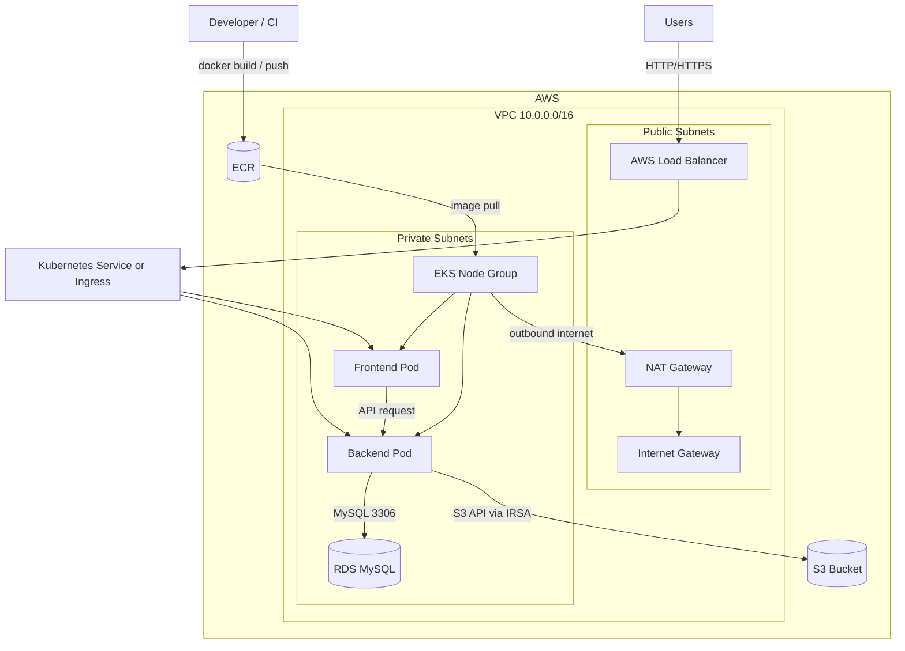
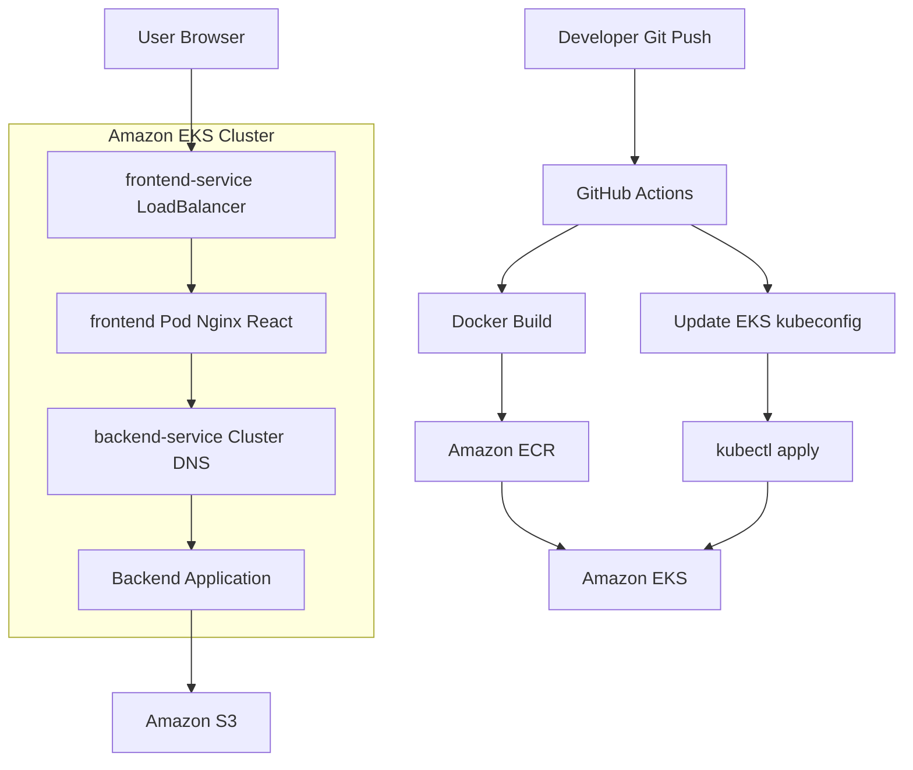
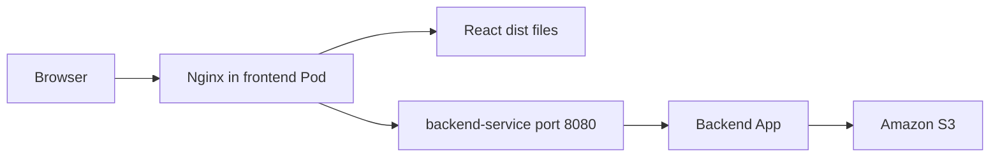
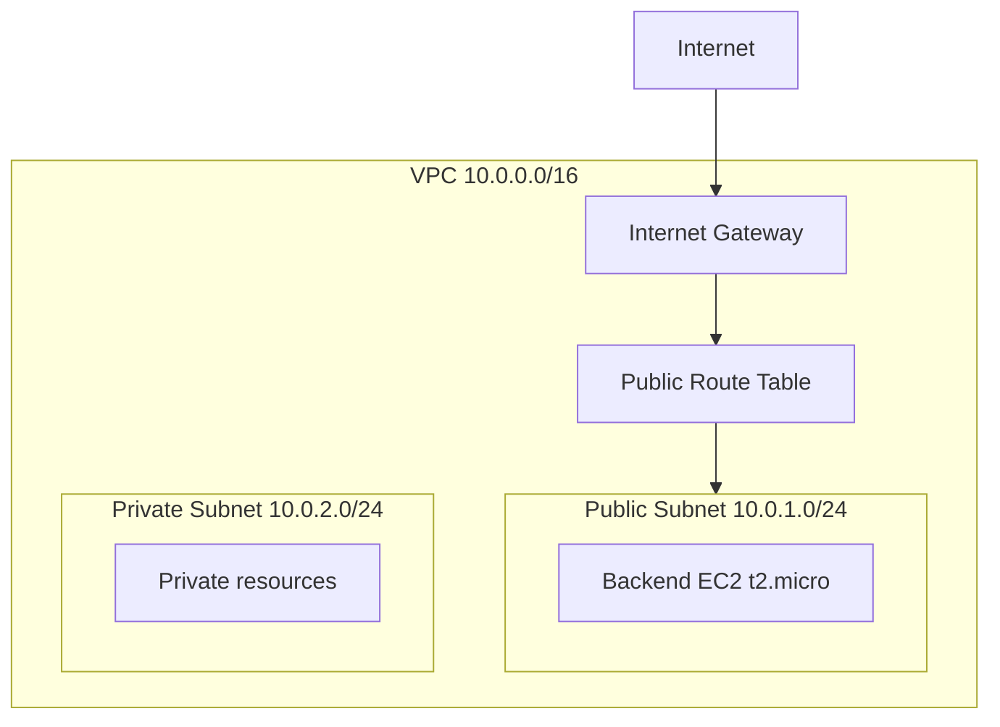

# AWS EKS Infrastructure Automation with Terraform & Kubernetes

Vite + React 기반의 샘플 프론트엔드 애플리케이션입니다. 정적 파일은 Nginx로 서빙하고, 백엔드 API 요청은 Nginx 프록시를 통해 Kubernetes 내부 백엔드 서비스로 전달합니다.

## 기술 스택

- React 18
- TypeScript
- Vite
- Nginx
- Docker
- Kubernetes
- Terraform
- AWS EKS/ECR/S3 backend

## 프로젝트 구조

```text
.
├── src/                    # React 애플리케이션 소스
├── public/                 # 정적 리소스
├── k8s/frontend.yaml       # 프론트엔드 Deployment/Service
├── terraform/              # Terraform 인프라 코드
│   ├── modules/network/    # Terraform VPC/Subnet 네트워크 모듈
│   ├── main.tf             # AWS 네트워크 및 백엔드 EC2 리소스
│   ├── provider.tf         # Terraform provider 및 remote state 설정
│   ├── variables.tf        # Terraform 변수
│   ├── outputs.tf          # Terraform output
│   └── terraform.tfvars    # Terraform 변수 값
├── Dockerfile              # Vite 빌드 및 Nginx 런타임 이미지
├── nginx.conf              # 정적 파일 서빙 및 API 프록시 설정
└── vite.config.ts          # Vite 설정
```

## 아키텍처

이 저장소는 프론트엔드 애플리케이션, 프론트엔드 Kubernetes 배포 매니페스트, 그리고 일부 AWS 네트워크/백엔드 EC2 인프라 Terraform 코드를 포함합니다.


```text
GitHub Actions
  |
  | docker build / push
  v
Amazon ECR
  |
  | image pull
  v
Amazon EKS
  |
  v
frontend-service (LoadBalancer)
  |
  v
frontend Deployment / Nginx / React 정적 파일
  |
  | /api/* proxy
  v
backend-service:8080
  |
  v
Backend Application
  |
  v
Amazon S3
```

현재 프론트엔드 운영 배포는 EKS와 ECR이 이미 준비되어 있다는 전제로 GitHub Actions에서 수행합니다. 워크플로는 이미지를 ECR에 push한 뒤, `${FRONTEND_IMAGE}`를 치환한 `k8s/frontend.yaml`을 EKS 클러스터에 적용합니다.

Terraform 코드는 VPC, 서브넷, 인터넷 게이트웨이, public route table, 백엔드 EC2 및 보안 그룹을 정의합니다. EKS 클러스터와 ECR 저장소 자체는 현재 이 Terraform 코드에 포함되어 있지 않고, GitHub Secrets의 `EKS_CLUSTER_NAME`, `ECR_FRONTEND_URI`로 참조됩니다.

### 전체 아키텍처


### 프론트 아키텍처




## AWS 인프라 구성

### Terraform remote state

Terraform state는 S3 backend에 저장하고 DynamoDB table로 lock을 잡습니다.

```text
S3 bucket: myapp-terraform-state-20260429
State key: training/lab06/terraform.tfstate
Region: us-west-1
Lock table: terraform-lock
```

### 네트워크

`terraform/modules/network`는 다음 네트워크 리소스를 생성합니다.

```text
VPC
  CIDR: 10.0.0.0/16
  DNS hostnames: enabled

Public Subnet
  CIDR: 10.0.1.0/24
  AZ: us-west-1a
  Public IP auto-assign: enabled
  Route: 0.0.0.0/0 -> Internet Gateway

Private Subnet
  CIDR: 10.0.2.0/24
  AZ: us-west-1a

Internet Gateway
  Attached to VPC

Public Route Table
  Associated with public subnet
```

현재 Terraform 코드에는 NAT Gateway와 private subnet route table은 정의되어 있지 않습니다. 따라서 private subnet에서 외부 인터넷으로 나가는 통신이 필요하면 NAT Gateway와 private route table을 추가해야 합니다.

### Mermaid 네트워크 구조



### 백엔드 인프라

`terraform/main.tf`는 백엔드용 EC2 인스턴스와 보안 그룹을 생성합니다.

```text
Backend EC2
  AMI: Latest Amazon Linux 2
  Instance type: t2.micro
  Subnet: public subnet
  Public IP: enabled by subnet setting

Security Group
  Inbound TCP 22: 0.0.0.0/0
  Inbound TCP 8080: 0.0.0.0/0
  Outbound: all traffic
```

Terraform output으로는 VPC ID와 백엔드 EC2 public IP를 제공합니다.

```text
vpc_id
backend_public_ip
```

## 프론트엔드 배포 구조

### 이미지 빌드

프론트엔드는 Docker multi-stage build를 사용합니다.

```text
node:18-alpine
  npm ci
  npm run build
  dist/ 생성

nginx:alpine
  /usr/share/nginx/html 에 dist/ 복사
  nginx.conf 적용
  80 포트로 서빙
```

### Kubernetes 리소스

`k8s/frontend.yaml`은 다음 리소스를 생성합니다.

```text
Namespace
  sample-app

Deployment
  name: frontend
  namespace: sample-app
  replicas: 2
  container port: 80
  readinessProbe: GET /
  livenessProbe: GET /

Service
  name: frontend-service
  namespace: sample-app
  type: LoadBalancer
  port: 80 -> targetPort: 80
```

### 프론트엔드와 백엔드 연결

Kubernetes 운영 환경에서 브라우저는 백엔드 주소를 직접 호출하지 않습니다. 프론트엔드 LoadBalancer 주소로 `/api/*` 요청을 보내고, 프론트엔드 Pod의 Nginx가 이를 Kubernetes 내부 서비스로 프록시합니다.

```text
Browser
  -> http://frontend-loadbalancer/api/hello
  -> frontend Nginx
  -> http://backend-service:8080/api/hello
  -> backend
```

이 구조에서는 Kubernetes Deployment에 `VITE_API_BASE_URL` 환경 변수를 설정하지 않아도 됩니다. 값이 없으면 프론트엔드 코드는 상대 경로인 `/api/...`를 호출하고, Nginx 프록시가 백엔드로 전달합니다.

단, `backend-service`는 같은 Kubernetes 클러스터와 namespace에서 DNS로 해석될 수 있어야 합니다. 현재 `nginx.conf`는 아래 대상을 전제로 합니다.

```text
http://backend-service:8080
```

## 로컬 실행

의존성을 설치합니다.

```bash
npm install
```

개발 서버를 실행합니다.

```bash
npm run dev
```

기본 접속 주소는 Vite 기본값인 `http://localhost:5173`입니다.

로컬에서 외부 백엔드 API를 직접 호출해야 하는 경우 `.env`에 Vite 환경 변수 형식으로 API 주소를 설정합니다.

```env
VITE_API_BASE_URL=http://localhost:8080
```

현재 애플리케이션 코드는 `import.meta.env.VITE_API_BASE_URL`을 읽습니다. 운영 배포처럼 같은 도메인의 `/api/*` 경로로 프록시할 때는 값을 비워둘 수 있습니다.

## 빌드

```bash
npm run build
```

빌드 결과물은 `dist/`에 생성됩니다.

## Docker 이미지

Dockerfile은 2단계 빌드를 사용합니다.

1. `node:18-alpine`에서 Vite 애플리케이션을 빌드합니다.
2. `nginx:alpine`에서 `dist/` 결과물을 `/usr/share/nginx/html`로 서빙합니다.

이미지 빌드 예시는 다음과 같습니다.

```bash
docker build -t aws-lab-frontend .
```

외부 API 주소를 빌드 시점에 주입해야 하는 경우:

```bash
docker build --build-arg VITE_API_BASE_URL=http://example.com -t aws-lab-frontend .
```

현재 운영 배포는 Nginx가 `/api/*` 요청을 Kubernetes 내부 `backend-service:8080`으로 프록시하므로 CI/CD에서 `VITE_API_BASE_URL`을 주입하지 않습니다.

## 통신 구조

### 전체 흐름

```text
사용자 브라우저
  |
  | HTTP 80
  v
Kubernetes LoadBalancer Service (frontend-service)
  |
  v
Frontend Pod / Nginx
  |\
  | \__ 정적 파일 요청: /, /assets/* -> /usr/share/nginx/html
  |
  \____ API 요청: /api/* -> backend-service:8080/api/*
                         |
                         v
                  Backend Service/Pod
                         |
                         v
                        S3
```

### 프론트엔드 요청

`src/App.tsx`에서 백엔드와 통신하는 API는 다음과 같습니다.

- `GET /api/hello`: 백엔드 연결 확인 메시지를 가져옵니다.
- `POST /api/upload`: 선택한 파일을 `multipart/form-data`로 업로드합니다.
- `GET /api/preview/{fileName}`: 업로드한 파일 미리보기를 가져옵니다.

프론트엔드는 API 주소를 다음 방식으로 결정합니다.

```ts
const apiBaseUrl = import.meta.env.VITE_API_BASE_URL ?? "";
```

- `VITE_API_BASE_URL`이 설정된 경우: `${VITE_API_BASE_URL}/api/...`로 요청합니다.
- 설정되지 않은 경우: `/api/...`로 요청하며, 운영 환경에서는 Nginx가 백엔드로 프록시합니다.

### Nginx 프록시

`nginx.conf`의 `/api/` location은 API 요청을 Kubernetes 내부 DNS 이름인 `backend-service`로 전달합니다.

```nginx
location /api/ {
    proxy_pass http://backend-service:8080/api/;
}
```

따라서 운영 환경에서는 브라우저가 백엔드 주소를 직접 알 필요가 없고, 프론트엔드와 같은 호스트의 `/api/*`만 호출하면 됩니다.

## Kubernetes 배포

`k8s/frontend.yaml`은 다음 리소스를 정의합니다.

- `Deployment/frontend`
  - replica: 2
  - container port: 80
  - readiness/liveness probe: `/`
- `Service/frontend-service`
  - type: `LoadBalancer`
  - port: 80

배포 시 `${FRONTEND_IMAGE}` 값이 실제 ECR 이미지 주소로 치환되어야 합니다.

```bash
envsubst < k8s/frontend.yaml | kubectl apply -f -
```

## CI/CD

`.github/workflows`의 GitHub Actions 워크플로는 `main` 브랜치 push 또는 수동 실행 시 다음 순서로 동작합니다.

1. AWS credentials 설정
2. Amazon ECR 로그인
3. Docker 이미지 빌드 및 push
4. EKS kubeconfig 업데이트
5. `k8s/frontend.yaml` 적용
6. rollout 완료 대기
7. LoadBalancer 접속 URL 출력

필요한 GitHub Secrets:

- `AWS_ACCESS_KEY_ID`
- `AWS_SECRET_ACCESS_KEY`
- `ECR_FRONTEND_URI`
- `EKS_CLUSTER_NAME`

## Terraform

Terraform은 AWS 리소스와 네트워크 모듈을 관리합니다.

주요 리소스:

- VPC: `10.0.0.0/16`
- Public subnet: `10.0.1.0/24`
- Private subnet: `10.0.2.0/24`
- Internet Gateway
- Public route table
- Backend EC2 security group
- Backend EC2 instance

remote state는 S3 backend와 DynamoDB lock table을 사용합니다.

```hcl
backend "s3" {
  bucket         = "myapp-terraform-state-20260429"
  key            = "training/lab06/terraform.tfstate"
  region         = "us-west-1"
  encrypt        = true
  dynamodb_table = "terraform-lock"
}
```

Terraform 실행 예시:

```bash
cd terraform
terraform init
terraform plan
terraform apply
```

## 주의 사항

- Vite 환경 변수는 `VITE_` 접두사가 필요합니다.
- Dockerfile은 필요 시 `VITE_API_BASE_URL` build arg를 받을 수 있습니다.
- 현재 GitHub Actions 운영 배포는 API 주소를 주입하지 않고, Nginx 프록시로 `/api/*` 요청을 처리합니다.
- 외부 API 주소를 직접 호출하는 배포로 바꾸는 경우에만 `--build-arg VITE_API_BASE_URL=...`를 사용합니다.
